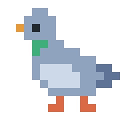
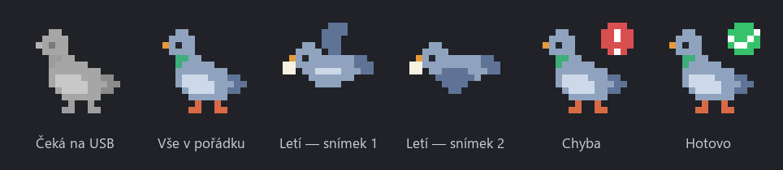
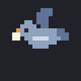
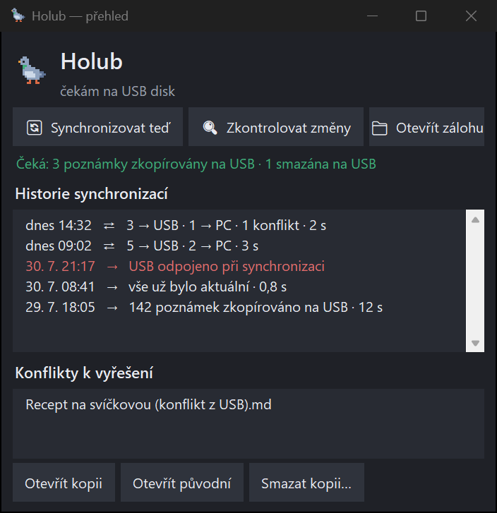

<p align="center">
  
</p>

<h1 align="center">Holub 🕊️</h1>

<p align="center">
  Poštovní holub pro tvoje poznámky — malá Windows appka v liště u hodin,<br>
  která sama zálohuje Obsidian vault na USB disk.
</p>

<p align="center">
  
  
  
</p>

<p align="center"><a href="README.md">English</a> · <b>Česky</b></p>

---

## Proč Holub?

Obsidian Sync má limit 1 GB na vault — větší vault se do něj prostě nevejde.
Holub jde jinou cestou: **žádný cloud, žádný účet, žádné nastavování**.
Poznámky se zálohují na obyčejný USB disk. Zasuneš flashku, holub vzlétne,
poznámky jsou v bezpečí. Žádné okno, žádné obrazovky s nastavením — celá
appka je jedna ikona v liště.

## Jak vypadá

Pixel-art holub v oznamovací oblasti hlásí, co se právě děje:



Při synchronizaci letí s poznámkou v zobáku:



V klidu si občas mrkne nebo klovne po něčem na zemi. Zásadní funkce.

Dvojklik na ikonu otevře okno Přehledu — historie synchronizací, nevyřešené
konflikty a kontrola nanečisto, co by příští synchronizace udělala:



## Co umí

- **Pozná svůj USB disk** podle skrytého souboru `.holub-usb` — funguje, i když
  disk dostane jiné písmeno (E:, F:…). Na cizí disk nikdy nezapisuje.
  Spárovat si můžeš klidně víc flashek a střídat je — synchronizuje se každý
  připojený spárovaný disk.
- **Záchranná síť při mazání** — nic se nemaže natvrdo: odstraněné soubory
  putují do skryté složky-koše `.holub-kos` a drží se tam 30 dní. A když by
  synchronizace chtěla smazat podezřele velkou část zálohy (víc než 20 %
  poznámek), Holub se zastaví a nejdřív se zeptá.
- **Synchronizuje sám při zasunutí USB**, nebo ručně z menu.
- **Okno Přehledu** (dvojklik na ikonu) — historie synchronizací, seznam
  nevyřešených konfliktů s tlačítky otevřít/smazat a „Zkontrolovat změny",
  které ukáže, co *by* synchronizace udělala, aniž by sáhla na jediný soubor.
  Tmavé od základu.
- **Jednosměrný režim (PC → USB)** — výchozí. USB je přesné zrcadlo vaultu:
  změněné poznámky se zkopírují, co smažeš na PC, zmizí i na USB. V tomto
  režimu appka **na PC nikdy nezapisuje** — jen čte.
- **Obousměrný režim (PC ⇄ USB)** — pro editaci na dalším počítači. Novější
  verze poznámky vyhrává. Konflikt (stejná poznámka změněná na obou stranách)
  se **nikdy nepřepíše potichu** — obě verze zůstanou, druhá jako
  `poznamka (konflikt z USB).md`.
- **Automatická synchronizace** — každých 15/30/60 minut, libovolný interval,
  nebo jednou denně v čas, který si zvolíš. Hodí se, když USB zůstává
  v počítači trvale; bez připojeného disku časovač jen tiše čeká.
- **Windows oznámení** po dokončení („12 poznámek zkopírováno na USB · 3 s")
  i při chybě, s vysvětlením co se stalo — a s tlačítkem, které rovnou otevře
  okno Přehledu.
- **Spouštění se systémem Windows** — zapíná se jedním kliknutím v menu.
- Ignoruje `workspace.json` Obsidianu (mění se každým kliknutím a jen by
  vyráběl zbytečné konflikty).

## Instalace

Potřebuješ Windows 10/11 a [Python](https://www.python.org/downloads/) 3.9
nebo novější.

```
git clone https://github.com/romelsteel/holub-usb-sync.git
cd holub-usb-sync
py -m pip install -r requirements.txt
pythonw holub.py
```

`pythonw` spustí appku bez černého okna. Holub se objeví v liště u hodin.

## První spuštění

1. Holub se představí oznámením a otevře dialog — **ukaž mu složku vaultu**.
   (Tip: napoprvé mu klidně dej cvičnou kopii pár poznámek a ostrý vault až
   potom, přes menu „Zvolit složku vaultu…".)
2. V menu zvol **„Spárovat nový USB disk…"** a vyber svůj USB disk. Holub si
   na něj zapíše skrytou značku a rovnou spustí první synchronizaci.
3. Hotovo. Od téhle chvíle stačí USB zasunout — o zbytek se stará holub.

Záloha na USB vypadá takhle:

```
E:\
  .holub-usb            párovací značka (skrytý soubor)
  .holub-kos\           koš — smazané poznámky, drží se 30 dní
  holub-snapshot.json   paměť posledního syncu (jen obousměrný režim)
  Vault\                kopie vaultu
```

## Menu (pravé tlačítko na ikonu)

```
Holub
vše synchronizováno · dnes 14:32
──────────────────────────────
🪟 Přehled a historie
🔄 Synchronizovat teď
⇄  Režim synchronizace        ▸
⏰ Automatická synchronizace  ▸
📁 Otevřít zálohu na USB
📂 Zvolit složku vaultu…
🔌 Spárovat nový USB disk…
✓  Spouštět se systémem Windows
──────────────────────────────
✕  Ukončit
```

## Bezpečnostní zásady

Holub nosí poznámky, neztrácí je. Proto platí bez výjimky:

1. Jednosměrný režim **nikdy nezapisuje ani nemaže na PC**.
2. Konflikt se **nikdy nepřepisuje potichu** — vždy zůstanou obě verze.
3. Když poznámku na jedné straně smažeš a na druhé mezitím upravíš,
   **úprava vyhrává** — poznámka se vrátí, nic se neztratí.
4. Bez párovací značky se **nesyncuje** — na cizí USB se nikdy nesahá.
5. Synchronizace nikdy neběží dvakrát naráz.
6. Mazání není nikdy okamžité a konečné: soubory jdou na 30 dní do koše
   `.holub-kos`, a synchronizace, která by smazala přes 20 % poznámek
   najednou, se zastaví a nejdřív se tě zeptá.

Kontrola „je USB připojené?" běží každých ~5 sekund, ale je to jen dotaz do
Windows na seznam disků — nic se nečte ani nekopíruje. A před kopírováním se
soubory porovnávají (datum úpravy + velikost), takže beze změn se na USB
nezapíše ani bajt.

## Když se něco pokazí

- **Červená ikona s vykřičníkem** = něco se nepovedlo; oznámení řekne co
  (plný disk, USB vytažené uprostřed synchronizace, zmizelá složka vaultu…).
- Po opravě stačí synchronizaci spustit znovu — dokončí se, kde přestala.
- Technické podrobnosti chyb se ukládají do `holub.log` vedle skriptu.

## Pod kapotou

Jeden soubor `holub.py` (~650 řádků), tři knihovny: `pystray` (ikona v liště),
`Pillow` (vykreslení pixel-artu), `winotify` (oznámení). Ikony se nekreslí
v editoru — holub je v kódu zapsaný jako textová pixelová mapa 16×16
a vykresluje se za běhu. Kompletní návrh, rozhodnutí a pixelové mapy jsou
v [plan.md](plan.md).

## Licence

[MIT](LICENSE) — dělej si s tím, co chceš, jen nech jméno autora v licenci.
