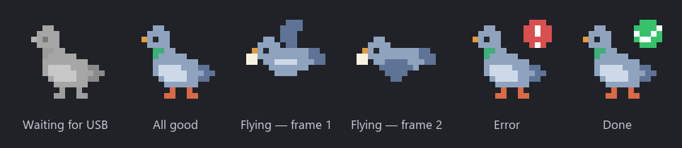

<p align="center">
  
</p>

<h1 align="center">Holub 🕊️</h1>

<p align="center">
  A carrier pigeon for your notes — a tiny Windows tray app<br>
  that backs up your Obsidian vault to a USB drive.
</p>

<p align="center">
  
  
  
</p>

<p align="center"><b>English</b> · <a href="README.cs.md">Česky</a></p>

---

## Why Holub?

Obsidian Sync caps a vault at 1 GB — a bigger vault simply won't fit. Holub
takes a different route: **no cloud, no account, nothing to configure**. Your
notes get backed up to an ordinary USB drive. Plug it in, the pigeon takes
off, your notes are safe. No window, no settings screens — the whole app is
one icon in the tray.

> **Note:** the app currently speaks Czech (menu and notifications).
> *Holub* is Czech for *pigeon*.

## What it looks like

The pixel-art pigeon in the tray tells you what's going on:



While syncing, it flies with a note in its beak:


## Features

- **Recognizes its USB drive** by a hidden `.holub-usb` marker file — works
  even when the drive gets a different letter (E:, F:…). It never writes to
  an unknown drive.
- **Syncs by itself when you plug the USB in**, manually from the menu, or by
  double-clicking the icon.
- **One-way mode (PC → USB)** — the default. The USB drive is an exact mirror
  of the vault: changed notes get copied, whatever you delete on the PC
  disappears from the USB too. In this mode the app **never writes to the
  PC** — it only reads.
- **Two-way mode (PC ⇄ USB)** — for editing on a second computer. The newer
  version of a note wins. A conflict (the same note changed on both sides) is
  **never overwritten silently** — both versions are kept, the second one as
  `note (konflikt z USB).md`.
- **Windows notifications** when a sync finishes ("12 notes copied to USB ·
  3 s") or fails, with an explanation of what happened.
- **Start with Windows** — toggled with one click in the menu.
- Ignores Obsidian's `workspace.json` (it changes with every click and would
  only produce pointless conflicts).

## Installation

You need Windows 10/11 and [Python](https://www.python.org/downloads/) 3.9
or newer.

```
git clone https://github.com/romelsteel/holub-usb-sync.git
cd holub-usb-sync
py -m pip install -r requirements.txt
pythonw holub.py
```

`pythonw` starts the app without a console window. Holub appears in the tray
next to the clock.

## First run

1. Holub introduces itself with a notification and opens a folder dialog —
   **show it your vault folder**. (Tip: give it a practice copy of a few
   notes first, and switch to the real vault later via the menu.)
2. Pick **"Spárovat nový USB disk…"** (*Pair a new USB drive*) in the menu
   and select your USB drive. Holub writes a hidden marker onto it and starts
   the first sync right away.
3. Done. From now on, just plug the drive in — the pigeon handles the rest.

The backup on the USB drive looks like this:

```
E:\
  .holub-usb            pairing marker (hidden file)
  holub-snapshot.json   memory of the last sync (two-way mode only)
  Vault\                copy of the vault
```

## The menu (right-click the icon)

```
Holub
vše synchronizováno · dnes 14:32     (all synced · today 14:32)
──────────────────────────────
🔄 Synchronizovat teď                (Sync now)
⇄  Režim synchronizace ▸             (Sync mode: one-way / two-way)
📁 Otevřít zálohu na USB             (Open the backup on USB)
📂 Zvolit složku vaultu…             (Choose vault folder…)
🔌 Spárovat nový USB disk…           (Pair a new USB drive…)
✓  Spouštět se systémem Windows      (Start with Windows)
──────────────────────────────
✕  Ukončit                           (Quit)
```

## Safety rules

Holub carries notes, it does not lose them. These rules hold without
exception:

1. One-way mode **never writes to or deletes from the PC**.
2. A conflict is **never overwritten silently** — both versions always
   survive.
3. If you delete a note on one side and edit it on the other in the meantime,
   **the edit wins** — the note comes back, nothing is lost.
4. No pairing marker, **no sync** — foreign USB drives are never touched.
5. A sync never runs twice at the same time.

The "is the USB plugged in?" check runs every ~5 seconds, but it is just a
query to Windows for the list of drives — nothing is read or copied. Files
are compared first (modification time + size), so when nothing changed, not
a single byte is written to the USB drive.

## When something goes wrong

- **Red icon with an exclamation mark** = something failed; the notification
  says what (disk full, USB yanked out mid-sync, vault folder gone missing…).
- After fixing the cause, just run the sync again — it finishes what is left.
- Technical details of errors go to `holub.log` next to the script.

## Under the hood

A single file, `holub.py` (~650 lines), and three libraries: `pystray` (tray
icon), `Pillow` (rendering the pixel art), `winotify` (notifications). The
icons are not drawn in an editor — the pigeon lives in the code as a 16×16
text pixel map and is rendered at runtime. The complete design, decisions and
pixel maps are in [plan.md](plan.md) (in Czech).

## License

[MIT](LICENSE) — do whatever you like with it, just keep the author's name in
the license.
